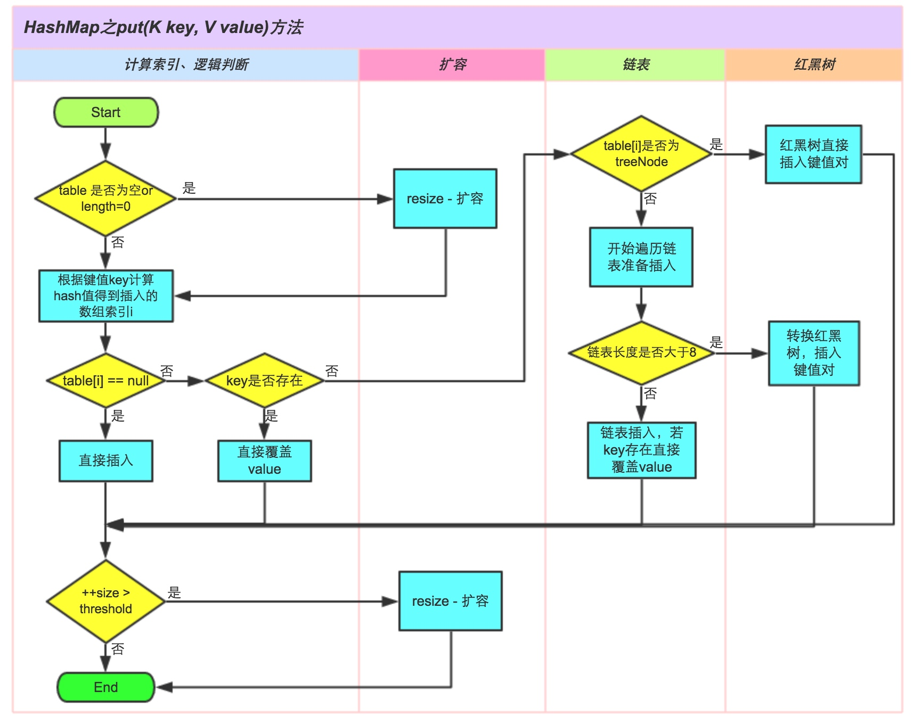

[TOC] 
#### 哈希表（来自维基百科） 
__也叫散列表（Hash table），根据键（key）而直接访问在内存存储位置的数据结构。它通过计算一个关于键值的函数，将所需查询的数据映射到表中一个位置来访问记录，加快了查找速度。这个映射函数称做散列函数，存放记录的数组称散列表。__ 
* 一个通俗的例子是，为了查找电话本中某人的号码，可以创建一个按照人名首字母顺序排列的表（即建立人名x到首字母F(x)的一个函数关系），在首字母为W的表中查找“王”姓的电话号码，显然比直接查找快。__这里使用人命作为关键字（key），取首字母是这个例子中散列函数的函数法则F()，存放首字母的表对应散列表。关键字和函数法则理论上可以任意指定。__ 
##### 基本概念 
* 若关键字为k，则其值存放在 _⨏(k)_ 的存储位置上。由此，不需要比较即可直接取得所查记录。称这个对应关系 _⨏()_ 为散列函数，按这个思想建立的表为散列表。 
* 对不同关键字可能得到同一个散列地址，即 _𝑘1≠𝑘2_ ，而 _⨏(𝑘1)=⨏(𝑘2)_ ，这种现象称为冲突（Collision）。具有相同函数值的关键字对散列函数来说乘坐同义词。综上所述，根据散列函数F(k)和处理冲突的方法，将一组关键字映射到一个有限的连续的地址集（区间）上，并以关键字在地址集中的像（类似于值的意思，相当于电话本中的W）作为记录在表中的存储位置，这种表变成为散列表，这一映射过程称为`散列造表`和`散列`,所得的存储位置称`散列地址`。 
* 若对于关键字集合中的任一个关键字，经散列函数映象到地址集合中任何一个地址的概率是相等的，则称此类散列函数为`均匀散列函数`（Uniform Hash function），这就使关键字经过散列函数得到一个“随机的地址”，从而减少冲突。
 
##### 构造散列函数（没细看呢，回头时间再说） 
散列函数能使对一个数据序列的访问过程更加迅速有效，通过散列函数，数据元素将被更快定位。 
* 直接定址法：	1.	取关键字或关键字的某个线性函数值为散列地址。即 _ℎ𝑎𝑠ℎ(𝑘)=𝑘_ 或 _ℎ𝑎𝑠ℎ(𝑘)=𝑎⋅𝑘 + 𝑏_ ，其中 _𝑎𝑏_ 为常数（这种散列函数叫做自身函数）

* 数字分析法：假设关键字是以r为基的数，并且哈希表中可能出现的关键字都是事先知道的，则可取关键字的若干数位组成哈希地址。平方取中法：取关键字平方后的中间几位为哈希地址。通常在选定哈希函数时不一定能知道关键字的全部情况，取其中的哪几位也不一定合适，而一个数平方后的中间几位数和数的每一位都相关，由此使随机分布的关键字得到的哈希地址也是随机的。取的位数由表长决定。 
* 折叠法：将关键字分割成位数相同的几部分（最后一部分的位数可以不同），然后取这几部分的叠加和（舍去进位）作为哈希地址。 
* 随机数法 
* 除留余数法：取关键字被某个不大于散列表表长m的数p除后所得的余数为散列地址。即 _ℎ𝑎𝑠ℎ(𝑘)=𝑘 mod 𝑝_ , _𝑝 ≤ 𝑚_  。不仅可以对关键字直接取模，也可在折叠法、平方取中法等运算之后取模。对p的选择很重要，一般取素数或m，若p选择不好，容易产生冲突。
##### 处理冲突 
为了知道冲突产生的相同散列函数地址所对应的关键字，必须选用另外的散列函数，或者对冲突结果进行处理。而不发生冲突的可能性是非常之小的，所以通常对冲突进行处理。常用方法有以下几种： 
* 开放定址法（open addressing）： 
_ℎ𝑎𝑠ℎᵢ=(ℎ𝑎𝑠ℎ(𝑘𝐞𝐲) + 𝑑ᵢ mod 𝑚 ,𝑖 = 1,2...𝑘(𝑘≤𝑚 - 1)_ ，其中 _ℎ𝑎𝑠ℎ(𝑘𝐞𝐲)_ 为散列函数，𝑚为散列表长，𝑑ᵢ为增量序列，𝑖为已发生冲突的次数。 
增量序列可有下列取法： 
1. 𝑑ᵢ = 1,2,3...(𝑚 - 1)称为 线性探测(Linear Probing)；即!𝑑ᵢ = 𝑖，或者为其他线性函数。相当于逐个探测存放地址的表，直到查找到一个空单元，把散列地址存放在该空单元。 
2. 𝑑ᵢ = ±1²,±2²,±3²...±𝑘²(𝑘 ≤ 𝑚/2)称为 平方探测(Quadratic Probing)。相对线性探测，相当于发生冲突时探测间隔𝑑ᵢ = 𝑖²个单元的位置是否为空，如果为空，将地址存放进去。 
3. 𝑑ᵢ = 伪随机数序列，称为 伪随机探测。 
__关键字为{89,18,49,58,69}插入到一个散列表中的情况。此时线性探测的方法是取𝑑ᵢ = 𝑖。并假定取关键字除以10的余数为散列函数法则。__ 

散列地址 | 空表 | 插入89 | 插入18 | 插入49 | 插入58 | 插入69 
--- | --- | ---| ---| ---| ---| ---
0 | | | | 49 |49|49| 
1 | | | | | 58 | 58 | 
2 | | | | | | 69 | 
3 | | | | | | | 
4 | | | | | | | 
5 | | | | | | | 
6 | | | | | | | 
7 | | | | | | | 
8 | | | 18 | 18 | 18 | 18 | 
9 | | 89 | 89 | 89 | 89 | 89 | 
--- | --- | ---| ---| ---| ---| ---

第一次冲突发生在填装49的时候。地址为9的单元已经填装了89这个关键字，所以取 𝑖 = 1 ，往下查找一个单位，发现为空，所以将49填装在地址为0的空单元。第二次冲突则发生在58上，取 𝑖=3，往下查找3个单位，将58填装在地址为1的空单元。69同理。 
表的大小选取至关重要，此处选取10作为大小，发生冲突的几率就比选择质数11作为大小的可能性大。越是质数，mod取余就越可能均匀分布在表的各处。 
__`聚集`（Cluster，也翻译做“堆积”）的意思是，在函数地址的表中，散列函数的结果不均匀地占据表的单元，形成区块，造成线性探测产生一次聚集（primary clustering）和平方探测的二次聚集（secondary clustering），散列到区块中的任何关键字需要查找多次试选单元才能插入表中，解决冲突，造成时间浪费。对于开放定址法，聚集会造成性能的灾难性损失，是必须避免的。__ 
* 单独链表法：将散列到同一个存储位置的所有元素保存在一个链表中。实现时，一种策略是散列表同一位置的所有冲突结果都是用栈存放的，新元素被插入到表的前端还是后端完全取决于怎样方便。 
* 双散列 
* 再散列： _ℎ𝑎𝑠ℎᵢ=(ℎ𝑎𝑠ℎ(𝑘𝐞𝐲) 𝑖 = 1,2...𝑘。ℎ𝑎𝑠ℎᵢ_
是一些散列函数。即在上次散列计算发生冲突时，利用该次冲突的散列函数地址产生新的散列函数地址，直到冲突不再发生。这种方法不易产生“聚集”（Cluster），但增加了计算时间。 
* 建立一个公共溢出区 
#### HashMap（JDK1.8） 
1. JDK 1.8 以前 HashMap 的实现是 数组+链表，即使哈希函数取得再好，也很难达到元素百分百均匀分布。 
2. JDK 1.8 以后数组+链表+红黑树（JDK1.8增加了红黑树部分）实现的 
3. 当 HashMap 中有大量的元素都存放到同一个桶中时，这个桶下有一条长长的链表，这个时候 HashMap 就相当于一个单链表，假如单链表有 n 个元素，遍历的时间复杂度就是 O(n)，完全失去了它的优势。 
4. 针对这种情况，JDK 1.8 中引入了红黑树（查找时间复杂度为 O(logn)）来优化这个问题 
* 允许使用 null 值，null 键 
* 线程不安全。 
线程安全的有 Hashtable 和 ConcurrentHashMap 

##### 构造参数 
```java 
public HashMap(int initialCapacity, float loadFactor) { 
    if (initialCapacity < 0) 
        throw new IllegalArgumentException("Illegal initial capacity: " + 
initialCapacity); 
    if (initialCapacity > MAXIMUM_CAPACITY) 
        initialCapacity = MAXIMUM_CAPACITY; 
    if (loadFactor <= 0 || Float.isNaN(loadFactor)) 
        throw new IllegalArgumentException("Illegal load factor: " + 
loadFactor); 
    this.loadFactor = loadFactor; 
    this.threshold = tableSizeFor(initialCapacity); 
} 
``` 
@param initialCapacity 容量 也就是bucket的大小，默认16 
@param loadFactor 加载因子 bucket填满程度的最大比例，默认0.75 
当bucket中的 entries数量大于 `Capacity*loadFactor`时就需要扩容，调整bucket的大小为当前的2倍。同时，初始化容量的大小也是2的幂次，则bucket的大小在扩容前后都是2的幂次（resize时带来便利）。 
__负载因子越大表示散列表的装填程度越高，反之愈小。对于使用链表法的散列表来说，查找一个元素的平均时间是O(1+a)，因此如果负载因子越大，对空间的利用更充分，然而后果是查找效率的降低；如果负载因子太小，那么散列表的数据将过于稀疏，对空间造成严重浪费。系统默认负载因子为0.75，一般情况下我们是无需修改的。__ 
* 如果对迭代性能要求高，不要把capacity设置过大，也不要把loadFactor设置过小，否则会导致bucket中的空位置过多，浪费性能 
* 如果对随机访问的性能要求很高的话，不要把loadFactor设置的过大，否则会导致访问时频繁碰撞，时间复杂度向O(n)退化 
* 如果数据增长很快的话，或数据规模可预知，可以在创建HashMap时主动设置capacity 
##### 数据结构 
```java 
java.lang.Object 
↳ java.util.AbstractMap<K, V> 
↳ java.util.HashMap<K, V> 
public class HashMap<K,V> 
extends AbstractMap<K,V> 
implements Map<K,V>, Cloneable, Serializable { } 
``` 
* HashMap 继承于 AbstractMap类，实现了Map接口。Map是"key-value键值对"接口，AbstractMap实现了"键值对"的通用函数接口。 
* HashMap是通过"拉链法"实现的哈希表。它包括几个重要的成员变量：table, size, threshold, loadFactor, modCount。 
* HashMap是数组+链表+红黑树（JDK1.8增加了红黑树部分）实现的，下面两张图更容易理解结构。 


* table数组是F(k) 
* 链表是Hash冲突 
* 链表长度大于8是专为红黑树 
##### 源码实现 
###### PUT 
执行过程先看下面这张图，源码实现以后再说。 




1. 判断键值对数组table[i]是否为空或为null，否则执行resize()进行扩容 
2. 根据键值Key计算Hash值得到插入的数组索引i，如果table[i]==null,直接新建街店添加，转向6，如果table[i]不为空，转向3 
3. 判断table[i]的首个元素是否和key一样，如果相同直接覆盖value，否则转向4，这里的相同指的是hashCode以及equals 
4. 判断table[i]是否为treeNode，即table[i]是否为红黑树，如果是红黑树，则直接在树中插入键值对，否则转向5 
5. 遍历table[i],判断链表长度是否大于8，大于8的话把链表转换为红黑树，在红黑树中执行插入操作，否则进行链表的插入操作；遍历过程中若发现key已经存在直接覆盖value即可； 
6. 插入成功后，判断实际存在的键值对数量size是否超多了最大容量threshold，如果超过，进行扩容。 
看一下当链表长度大于8时，转换成红黑树的代码 

```java 
//将桶内所有的 链表节点 替换成 红黑树节点 
final void treeifyBin(Node<K,V>[] tab, int hash) { 
    int n, index; Node<K,V> e; 
    //如果当前哈希表为空，或者哈希表中元素的个数小于 进行树形化的阈值(默认为 64)，就去新建/扩容 
    if (tab == null || (n = tab.length) < MIN_TREEIFY_CAPACITY) 
resize(); 
    else if ((e = tab[index = (n - 1) & hash]) != null) { 
        //如果哈希表中的元素个数超过了 树形化阈值，进行树形化 
        // e 是哈希表中指定位置桶里的链表节点，从第一个开始 
        TreeNode<K,V> hd = null, tl = null;//红黑树的头、尾节点 
        do { 
        //新建一个树形节点，内容和当前链表节点 e 一致 
        TreeNode<K,V> p = replacementTreeNode(e, null); 
        if (tl == null)//确定树头节点 
            hd = p; 
        else { 
            p.prev = tl; 
            tl.next = p; 
        } 
        tl = p; 
    } while ((e = e.next) != null); 
    //让桶的第一个元素指向新建的红黑树头结点，以后这个桶里的元素就是红黑树而不是链表了 
    if ((tab[index] = hd) != null) 
        hd.treeify(tab); 
    } 
} 
``` 
* 根据哈希表中元素个数确定是扩容还是树形化 
* 如果是树形化遍历桶中的元素，创建相同个数的树形节点，复制内容，建立起联系 
* 然后让桶第一个元素指向新建的树头结点，替换桶的链表内容为树形内容 


