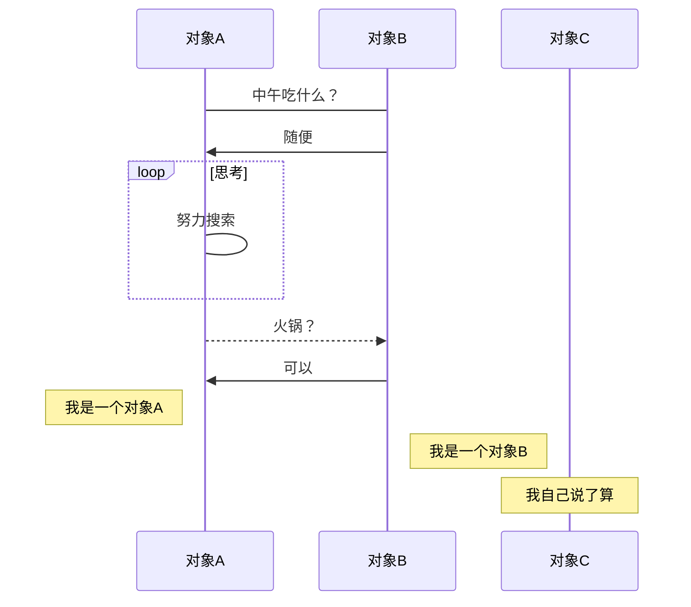

```sequence

Glide-> Glide:getRetriever

Glide-> GlideBuild : 
activate GlideBuild
Note left of Glide: 调用with
Note over Glide: 
GlideBuilder -> RequestManagerRetriever:
RequestManagerRetriever -> RequestManagetFactory :构造函数中初始化factory
RequestManagetFactory -> RequestManager : build()


```




Glide.with(Context)最后返回 RequestManager,其中经过创建 RequestManagerRetriever,

